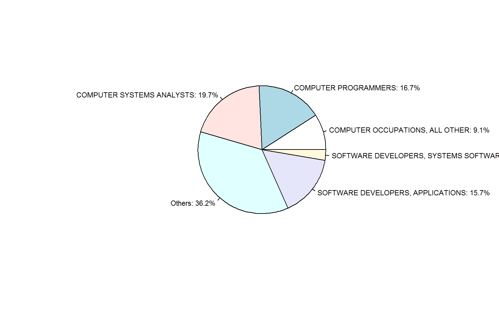
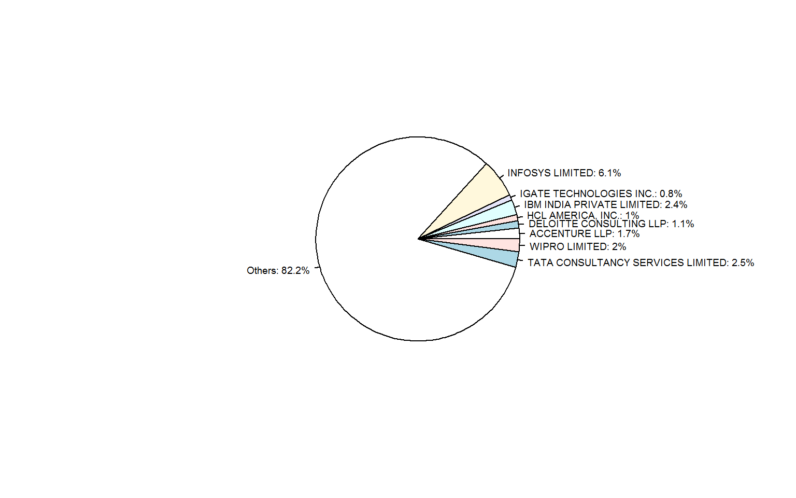

## H1B Data Description  
The USCIS received around 233,000 H1B petitions during the filling period in 2015, which is another new high after last year's 172,000 applications. The USCIS uses a compter-generated random selection process to select enough petitions to meet the 6,500 general-category cap and 20,000 cap under the advanced degree exemption. To increase tranparency, the United States release a Excel file every year with data pertaining to H-1B Visas and the like. This year's data can be downloaded [here](http://www.foreignlaborcert.doleta.gov/docs/py2015q2/H-1B_FY15_Q2.xlsx). The dataset contains certification determinations issued between October 1, 2014 and March 30, 2015. Thanks to my alumni John Zhou who introduced this dataset to me. I explored the dataset using [R](http://www.r-project.org/) with several data analysis and visulization libraries.

Here are the columns in the dataset that I found interesting:  

* `VISA_CLASS`: Indicates the type of temporary application submitted for processing. H-1B; E-3 Australian; H-1B1 Chile; H-1B1 Singapore. Also referred to as "Program" in prior years.  
* `SOC_NAME`: Occupational name associated with the job being requested for temporary labor condition, as classified by the Standard Occupational Classification (SOC) System.  
* `EMPLOYER_NAME`: Name of employer submitting labor condition application.  
* `WORKSITE_STATE`: State information of the foreign worker's intended area of employment.  
* `WAGE_RATE_OF_PAY`: Rate of pay offered  
* `WAGE_UNIT_OF_PAY`: Unit of pay.  Valid values include "Hour", "Week", "Bi-Weekly", "Month", or "Year"  

## Data Analysis:

We start with loading the libraries we are going to use:

```r
library(ggplot2)
library(readxl)
library(knitr)
library(dplyr)
library(maps)
library(stringr)
opts_chunk$set(fig.width=10, fig.path="../figure/")
```
The Excel file is over 80 MB which is a bit slow for R to swallow, so I decided to try out the newly published [*readxl* package] (http://cran.r-project.org/web/packages/readxl/index.html). 

```r
file.info("H-1B_FY15_Q2.xlsx")$size
```

```
## [1] 87517742
```

```r
h1b<-read_excel("H-1B_FY15_Q2.xlsx")
```
It works just fine for me.  

### Data Cleaning

First, I selected only H1-B petitions and converted the wages to year bases using `WAGE_RATE_OF_PAY` and `WAGE_UNIT_OF_PAY` columns.

```r
#select the column of interest, fix the data type, convert wage to year bases
h1b_tidy<-h1b%>%select(CASE_NO,
                       CASE_STATUS,
                       CASE_SUBMITTED,
                       DECISION_DATE,
                       VISA_CLASS,
                       EMPLOYER_NAME,
                       SOC_NAME,
                       WAGE_RATE_OF_PAY_FROM,
                       WAGE_RATE_OF_PAY_TO,
                       WAGE_UNIT_OF_PAY,
                       WORKSITE_COUNTY,
                       WORKSITE_STATE)%>%
                filter(VISA_CLASS=="H-1B")%>%
                mutate_each_(funs(as.factor), 
                             c("CASE_STATUS",
                               "VISA_CLASS",
                               "EMPLOYER_NAME",
                               "SOC_NAME", 
                               "WAGE_UNIT_OF_PAY", 
                               "WORKSITE_COUNTY", 
                               "WORKSITE_COUNTY"))%>%
                mutate_each_(funs(as.numeric),
                             c("WAGE_RATE_OF_PAY_FROM","WAGE_RATE_OF_PAY_TO"))%>%
                mutate(WAGE_RATE=apply(cbind(WAGE_RATE_OF_PAY_FROM, WAGE_RATE_OF_PAY_TO),1, FUN=function(x) mean(x,na.rm=TRUE)))%>%
                mutate(WAGE=WAGE_RATE*unlist(sapply(as.character(WAGE_UNIT_OF_PAY),  switch, "Week"=52,
                                              "Bi-Weekly"=52/2,
                                              "Hour"=8*240,
                                              "Month"=12,
                                              "Year"=1,0)))
```

There are appearently some incorrect records in the wages, e.g. wrong wage unit. Here I removed records with yearly wage more than half a million. Please let me know if you have applied H1B this year with more than half a million income, we should make friends:)  


```r
h1b_tidy<-filter(h1b_tidy, WAGE<500000 | WAGE==0, VISA_CLASS=="H-1B")
nrow(h1b_tidy)
```

```
## [1] 0
```


I used SOC_NAME as the occupation information since it covers much wider range than JOB_TITLE column. For example, PROGRAMMER ANALYST and DEVELOPMENT SENIOR are both classified as COMPUTER PROGRAMMERS using SOC_NAME.

### Questions of Interest
Let us check several questions of interest.

* Top 5 majors of H1B applications

```r
socTop<-row.names(as.data.frame(summary(h1b_tidy$SOC_NAME)))[1:5]
h1b_tidy<-mutate(h1b_tidy, soc5=ifelse(SOC_NAME %in% socTop, 
                                         as.character(SOC_NAME), 
                                         "Others"))
soc<-table(h1b_tidy$soc5)
percent<-paste0(100*round(soc/sum(soc),3),"%")
labels<-do.call(paste,c(as.data.frame((cbind(names(soc),percent))),list(sep=": ")))
pie(as.numeric(soc/sum(soc)),label=labels,radius=0.7,cex=0.7)
```

```
## Error in seq.int(x[i], x[i + 1], length.out = n): 'length.out' must be a non-negative number
```

 

Computer science is definitely the way to go. For incoming international students who haven't chosen a major, I hope this is informative enough.

* Top 8 popular employer

```r
companyTop<-row.names(as.data.frame(summary(h1b_tidy$EMPLOYER_NAME)))[1:8]
h1b_tidy<-mutate(h1b_tidy, company5=ifelse(EMPLOYER_NAME %in% companyTop, 
                                         as.character(EMPLOYER_NAME), 
                                         "Others"))

company<-table(h1b_tidy$company5)
percent<-paste0(100*round(company/sum(company),3),"%")
labels<-do.call(paste,c(as.data.frame((cbind(names(company),percent))),list(sep=": ")))
pie(as.numeric(company/sum(company)),label=labels,radius=0.7,cex=0.6)
```

```
## Error in seq.int(x[i], x[i + 1], length.out = n): 'length.out' must be a non-negative number
```

 

Interestingly, most of the top popular employers are technology service companies which have headquarter or major business in India. They are INFOSYS, IGATE (recently accquired by Capgemini), IBM India, HCL, WIPRO, and TATA.

* Top 5 jobs with the highest income.

```r
H1B_income<-h1b_tidy%>%group_by(SOC_NAME)%>%summarise(AvgIncome=mean(WAGE))%>%arrange(desc(AvgIncome))
ggplot(H1B_income[1:5,], aes(x=SOC_NAME, y=AvgIncome))+
  geom_bar(stat="identity", fill = I("grey50"))+
  scale_x_discrete(labels = function(x) str_wrap(x, width = 5))+
  xlab("Job Title")+
  ylab("Average Income ($ per year)")
```

```
## Warning in loop_apply(n, do.ply): Removed 5 rows containing missing values
## (position_stack).
```

```
## Warning in loop_apply(n, do.ply): no non-missing arguments to min;
## returning Inf
```

```
## Warning in loop_apply(n, do.ply): no non-missing arguments to max;
## returning -Inf
```

```
## Warning in loop_apply(n, do.ply): position_stack requires constant width:
## output may be incorrect
```

```
## Error in matrix(value, n, p): 'data' must be of a vector type, was 'NULL'
```

For international students, attending medical schools seems very promising, although the upfront investment could be [huge](http://www.usnews.com/education/best-graduate-schools/the-short-list-grad-school/articles/2015/03/17/10-most-affordable-private-medical-schools).

* Number of H1b Applicants of the lower 48 states:

```r
library(maps)
H1B_State<-h1b_tidy%>%group_by(WORKSITE_STATE)%>%summarise(NoH1B=length(WORKSITE_STATE))%>%arrange(desc(NoH1B))
H1B_State$STATE<-tolower(state.name[match(H1B_State$WORKSITE_STATE,state.abb)])
states_map <- map_data("state")
ggplot(H1B_State, aes(map_id = STATE)) + 
    geom_map(aes(fill = NoH1B), map = states_map) +
    scale_fill_gradient(low="#dfd6e9", high="#0570b0", name="No. H1B Applicants")+ 
    expand_limits(x = states_map$long, y = states_map$lat) +
    theme(
    plot.background = element_blank(),
    panel.grid.major = element_blank(),
    panel.grid.minor = element_blank(),
    panel.border = element_blank(),
    axis.ticks = element_blank(),
    axis.text = element_blank(),
    axis.title = element_blank()
  )
```

```
## Error in unit(tic_pos.c, "mm"): 'x' and 'units' must have length > 0
```

I have found a lot of similarity between this map and the [GDP by state map](http://www.bea.gov/iTable/iTableHtml.cfm?reqid=99&step=11&isuri=1&9993=levels&9936=-1&9935=-1&9934=5&9995=beastandard&9904=naics&9905=1&9907=2014&9990=99&9901=1200&9902=1&9903=200).


